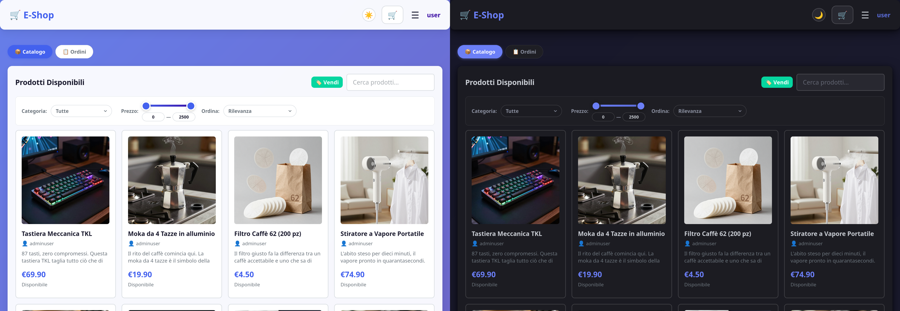

# 🛒 E-Shop — Spring Boot REST API

<p align="center">
  <a href="https://github.com/comicrocharly/E-Shop_Concept/actions/workflows/ci.yml"></a>
  <a href="https://github.com/comicrocharly/E-Shop_Concept/actions/workflows/cd.yml"></a>
</p>

<p align="center">
  
</p>

Un e-commerce RESTful completo costruito con **Spring Boot 3.x**, con autenticazione, gestione prodotti, carrello e ordini.

---

## 📋 Panoramica

E-Shop è un'applicazione backend REST completa che gestisce un intero flusso e-commerce: dalla registrazione utente alla creazione di ordini, passando per la gestione del catalogo e del carrello. Include anche un'interfaccia frontend in HTML/CSS/JS per testare e utilizzare l'applicazione direttamente dal browser.

---

## 🛠️ Tech Stack

| Livello | Tecnologia | Versione |
|---------|-----------|----------|
| **Runtime** | Java | 21 |
| **Framework** | Spring Boot 3.x | 3.4.1 |
| **Data Access** | Spring Data JPA | — |
| **Database** | PostgreSQL | 16 (Docker) |
| **Sicurezza** | Spring Security | JWT + Role-based |
| **Validazione** | Jakarta Validation | Bean Validation 3.0 |
| **Testing** | Testcontainers + JUnit 5 | 1.21.4 |
| **E2E Testing** | Playwright (driver Java) + Chromium | 1.55 |
| **Build** | Maven | 3.x |
| **Frontend** | HTML5 / CSS3 / Vanilla JS (single page) | — |
| **Frontend serving** | nginx | 1.27-alpine |
| **Infra dev** | Kubernetes (kind) + PostgreSQL 16 (primary + 2 replica) | — |

---

## 🏗️ Architettura

L'applicazione segue l'architettura a layer tipica di Spring Boot:

```
┌─────────────────────────────────────────────┐
│              Frontend (index.html)           │
│     HTML5 + CSS3 + Vanilla JavaScript        │
└────────────────────┬────────────────────────┘
                     │  REST (JSON)
┌────────────────────▼────────────────────────┐
│              Controllers (REST API, 8)       │
│  Auth │ Articles │ Category │ Cart │ Order   │
│  User │ PhoneNumber │ Address               │
└────────────────────┬────────────────────────┘
                     │
┌────────────────────▼────────────────────────┐
│                Services (Logic)              │
│  UserService │ ArticlesService │ CartService │
│  OrderService │ PhoneNumberService │ AddressService │
│  JwtTokenProvider │ PaymentGatewayService   │
│  (MockPaymentGateway)                     │
└────────────────────┬────────────────────────┘
                     │
┌────────────────────▼────────────────────────┐
│            Repositories (JPA, 7)             │
│  User │ Articles │ Cart │ Order │ OrderPayment │
│  PhoneNumber │ Address                     │
└────────────────────┬────────────────────────┘
                     │
┌─────────────────────────────────────────────┐
│            Entities (JPA/Hibernate, 9)       │
│  User │ Articles │ Category │ Cart │ CartItem │
│  Order │ OrderItem │ OrderPayment │ PhoneNumber │
│  Address                                      │
└────────────────────┬────────────────────────┘
                     │
┌────────────────────▼────────────────────────┐
│            PostgreSQL Database (16)          │
└─────────────────────────────────────────────┘
```

Security by layer: Spring Security (JWT stateless + BCrypt + role-based
`@PreAuthorize`), `RateLimitFilter` su login/register (sliding window in-memory),
CORS per il frontend.

---

## 📊 Entity Relationship

```
User 1:1 Cart 1:N CartItem
User 1:N Order 1:N OrderItem, 1:1 OrderPayment (per ordine pagato)
User 1:N PhoneNumber, 1:N Address
Articles 1:N CartItem, OrderItem
Category (gerarchia parent) ↔ Articles
```

| Entity | Campi Principali |
|--------|-----------------|
| **User** | id, username, email, password (BCrypt), role (USER/ADMIN) |
| **Articles** | id, name, description, price, stock, category |
| **Category** | id, name, parent (gerarchia) |
| **Cart** | id, user (FK) |
| **CartItem** | id, cart (FK), article (FK), quantity, unitPrice (sync al prezzo corrente) |
| **Order** | id, user (FK), status, total, paymentMethod, reservedStock, orderDate |
| **OrderItem** | id, order (FK), article (FK), quantity, unitPrice (bloccato al checkout) |
| **OrderPayment** | id, order (FK), paymentMethod, amount, status, transactionId |
| **PhoneNumber** | id, user (FK), countryPrefix, number, phoneType (MOBILE/FIXED) |
| **Address** | id, user (FK), street, streetNumber, postalCode, city, country |

---

## 🔌 REST API Endpoints

### 🔐 Auth (stateless JWT)
| Metodo | Endpoint | Descrizione |
|--------|----------|-------------|
| `POST` | `/api/auth/register` | Registra un nuovo utente (rate limited 10/min) |
| `POST` | `/api/auth/login` | Login → access token (1h) + refresh token (24h) (rate limited 30/min) |
| `POST` | `/api/auth/refresh` | Renew access token con refresh token |

### 📦 Articles
| Metodo | Endpoint | Descrizione |
|--------|----------|-------------|
| `GET` | `/api/articles` | Lista prodotti (pagina, `search`, `category`, `minPrice`, `maxPrice`) |
| `GET` | `/api/articles/{id}` | Dettaglio prodotto |
| `GET` | `/api/articles/by-author/{authorId}` | Prodotti per autore |
| `POST` | `/api/articles` | Crea prodotto (ADMIN) |
| `PUT` | `/api/articles/{id}` | Aggiorna prodotto (ADMIN) |
| `DELETE` | `/api/articles/{id}` | Elimina prodotto (ADMIN) |
| `GET` | `/api/categories` | Lista categorie (gerarchia) |

### 🛒 Cart
| Metodo | Endpoint | Descrizione |
|--------|----------|-------------|
| `GET` | `/api/cart/me` | Leggi il proprio carrello |
| `POST` | `/api/cart/items` | Aggiungi al carrello (`{articleId, quantity}`) |
| `DELETE` | `/api/cart/items/{articleId}` | Rimuovi articolo dal carrello |
| `DELETE` | `/api/cart/clear` | Svuota carrello |
| `GET` | `/api/cart/total` | Calcola totale |

### 🧾 Orders (checkout 2-step + pagamento)
| Metodo | Endpoint | Descrizione |
|--------|----------|-------------|
| `POST` | `/api/orders/checkout/prepare` | Prepara ordine: PENDING, riserva stock, svuota carrello |
| `POST` | `/api/orders/{id}/pay` | Paga (MockPaymentGateway) → PROCESSING, deduce stock, crea OrderPayment |
| `POST` | `/api/orders/checkout` | Legacy checkout in 1 step (retrocompatibilità) |
| `GET` | `/api/orders/my` | Storico ordini utente (pagina + filtro `status`) |
| `GET` | `/api/orders/{id}` | Dettaglio ordine |
| `POST` | `/api/orders/{id}/cancel` | Annulla ordine |
| `PUT` | `/api/orders/{id}/complete` | Conferma ricezione (DELIVERED → COMPLETED) |
| `GET` | `/api/orders` | Tutti gli ordini (ADMIN) |
| `GET` | `/api/orders/admin` | Tutti gli ordini con utente/items (ADMIN, pagina+search+filter) |
| `PUT` | `/api/orders/{id}/status?status=X` | Aggiorna stato ordine (ADMIN) |

### 👤 User / Phone / Address
| Metodo | Endpoint | Descrizione |
|--------|----------|-------------|
| `GET` | `/api/users/me` | Profilo utente corrente |
| `PUT` | `/api/users/me/profile` | Aggiorna email / password (con `currentPassword`) |
| `GET` | `/api/users/{userId}/phone/me` | Lista telefoni |
| `POST` | `/api/users/{userId}/phone/me` | Aggiungi telefono |
| `DELETE` | `/api/users/{userId}/phone/me/{phoneId}` | Elimina telefono |
| `GET` | `/api/users/{userId}/address/me` | Lista indirizzi |
| `POST` | `/api/users/{userId}/address/me` | Aggiungi indirizzo |
| `DELETE` | `/api/users/{userId}/address/me/{addressId}` | Elimina indirizzo |

---

## ✨ Funzionalità

- ✅ **Registrazione e Login** — con validazione email e password (min 6 char)
- ✅ **JWT stateless** — access token (1h) + refresh token (24h), endpoint `/api/auth/refresh`
- ✅ **Password BCrypt** — hashate al registro, mai in chiaro
- ✅ **Rate limiting** — login 30/min, register 10/min (sliding window, headers X-RateLimit-*)
- ✅ **Ruoli utente** — USER e ADMIN con `@PreAuthorize` differenziato
- ✅ **Catalogo prodotti** — CRUD completo, stock, categorie (gerarchia), filtri/prezzi/ricerca
- ✅ **Carrello** — Aggiungi, rimuovi, svuota, calcolo totale; unitPrice sincronizzato al prezzo corrente
- ✅ **Ordini** — Checkout 2-step (prepare→pay) + legacy 1-step, stati PENDING→PROCESSING→SHIPPED→DELIVERED→COMPLETED/CANCELLED
- ✅ **Pagamento** — PaymentGatewayService + MockPaymentGateway (carta/PayPal/COD/bonifico), OrderPayment
- ✅ **Telefono e indirizzi** — CRUD per utente
- ✅ **Gestione errori globale** — Mapping errori HTTP (400/403/404/409/500)
- ✅ **Prevenzione cicli Jackson** — `@JsonIgnore` su relazioni bidirezionali
- ✅ **Frontend responsive** — single page HTML/CSS/JS con design moderno (modal pagamento, admin panel, settings); in K8s servita da nginx (`frontend/`), che fa da proxy `/api/` e `/images/` verso il backend
- ✅ **Immagini articoli** — più immagini per articolo (tabella `article_images`), servite su `/images/articles/**`, con miniatura hover e lightbox navigabile nella scheda dettaglio

> **🖼️ Crediti immagini (frontend mockup)** — le immagini prodotto di questo progetto sono state generate con
> [**txt2mock_batchgen**](https://github.com/comicrocharly/txt2mock_batchgen), altro mio progetto di **generazione massiva di immagini mockup via ComfyUI API**:
> un LLM converte le righe della tabella `articles` in prompt English (`items.json`), e lo script trasforma il file in un batch di PNG (workflow **Z-Image Turbo**). Le immagini generate risiedono in `data/article-images/` e sono associate agli articoli.

---

## 🧪 Testing

Suite **rebuild** completata il 2026-08-17 (vedi `REBUILD_PLAN.md` per dettagli e note tecniche):
**302/302 test verdi** con `mvn test` (serve Docker per Testcontainers PostgreSQL 16), **più 12 test E2E browser (S5)**.

| Sezione | Pacch. | Test | Descrizione |
|---------|--------|------|-------------|
| S0 | `com.eshop` | 2 | Smoke: contesto + round-trip DB |
| S1 | `com.eshop.config` | 12 | JwtTokenProvider (access/refresh, expired, tampered) |
| S2 | `com.eshop.service` | 113 | Services (Mockito) + transizioni OrderStatus |
| S3 | `com.eshop.controller` | 83 | `@WebMvcTest` per i 8 controller (services mockati) |
| S4 | `com.eshop.integration` | 92 | Full-stack `@SpringBootTest` + Testcontainers + MockMvc (Auth 19, Articles 14, Cart 12, Orders 28, User 18, Gateway 1) |
| S5 | `com.eshop.playwright` | 12 | **E2E browser** (Playwright Java 1.55, Chromium): 3 smoke + 9 flow utente completo |

- Profilo test: `@ActiveProfiles("test")` → `SecurityTestConfig` (`permitAll` + param `?testUser=`), rate limit alzati in `application-test.properties`
- DB test: Testcontainers PostgreSQL 16 (`jdbc:tc:postgresql:16:///eshop`, `create-drop`, container condiviso per JVM)
- I bug noti dell'app (B1–B8) sono documentati da test che asseriscono il comportamento attuale (sezione §2.5 di `REBUILD_PLAN.md`)

### E2E browser (S5 — Playwright)

| Classe | Test | Cosa copre |
|--------|------|------------|
| `PlaywrightSmokeTest` | 3 | App reachable, rendering catalogo, login |
| `ShopFlowTest` | 9 | Flussi utente completi: registrazione, CRUD admin, ricerca, carrello, **checkout + pagamento** (carta e COD), stati ordine, pannello admin |

- **Gated**: `@EnabledIfSystemProperty(named = "e2e.enabled", matches = "true")` → `mvn verify` normale **non li esegue mai** (servono un'app up e Chromium)
- Base URL = **ingresso frontend** (`http://localhost:8080`), non il backend: i test passano per nginx come un utente reale
- Credenziali admin da env `E2E_ADMIN_USERNAME`/`E2E_ADMIN_PASSWORD` (fallback `admin`/`admin123`, i dati del seed)
- `MockPaymentGateway` simula un **1% di fallimenti random**: i test di pagamento ritentano fino a 3 volte per non essere flaky
- In locale (con lo stack K8s up):
  ```bash
  mvn test -Dtest='PlaywrightSmokeTest,ShopFlowTest' \
      -De2e.enabled=true -De2e.baseUrl=http://localhost:8080
  ```
- In CI **non girano** (nessun cluster); girano in **CD** sul runner GitHub-hosted, dopo il deploy su un cluster kind effimero

---

## 🚀 Avvio Rapido

### Requisiti
- Java 21
- Maven 3.x
- Docker
- `kind` + `kubectl` (solo per lo stack Kubernetes)

### Avvio con il nuovo stack (Kubernetes + nginx + PostgreSQL)
```bash
./start-k8s.sh
```
Idempotente: crea il cluster `kind` (1 control-plane + 2 worker), applica
namespace/secret/PostgreSQL (StatefulSet+PVC)/nginx, builda l'immagine,
deploya le 3 repliche con rolling update e attende l'ingresso HTTP.

L'applicazione sarà disponibile su:
- **Frontend**: http://localhost:8080 (nginx → 3 replica → PostgreSQL)
- **API**: http://localhost:8080/api

Comandi utili (`make help` implicita, vedi `Makefile`):
```bash
make status     # stato cluster/app
make logs       # log app in tempo reale
make rollback   # undo ultimo rollout
make down       # smonta tutto
```

### Avvio semplice (senza Kubernetes, per debug)
```bash
mvn spring-boot:run   # richiede un PostgreSQL raggiungibile
```
Sulle porte locali l'app ascolta su `8081` (solo API: la SPA è servita da `frontend/` nel flusso K8s).

### Test

```bash
# unit + controller + integration (302 test; serve Docker per Testcontainers)
mvn test

# E2E browser (12 test) — richiede stack K8s up su :8080 + Chromium
mvn test -Dtest='PlaywrightSmokeTest,ShopFlowTest' \
    -De2e.enabled=true -De2e.baseUrl=http://localhost:8080
```

---

## 🔄 CI/CD

Tutto gira su **runner GitHub-hosted** (`ubuntu-latest`): nessun self-hosted runner, quindi il codice di un PR (anche da un contributor esterno) **non viene mai eseguito sulle macchine del team**.

| Workflow | Trigger | Cosa fa | Runner |
|----------|---------|---------|--------|
| `ci.yml` | PR + push main | **Lint gate**: Checkstyle (Java) + ESLint (frontend) → `mvn verify` (315 test, Testcontainers → PostgreSQL reale) → build immagine; su main push su **GHCR** tagata col SHA | GitHub-hosted |
| `cd.yml` | push main | Cluster **kind effimero** (1 control-plane + 2 workers) → PostgreSQL 16 (primary + 2 replica, streaming replication) → build + `kind load` → rollout → **seed demo** → **smoke test** su `:8080` → **E2E Playwright** → rollback best-effort (`rollout undo`) su fallimento | GitHub-hosted |

### 🔐 Secrets (Settings → Secrets and variables → Actions)

I secret non sono mai hardcoded: in CI/CD vengono iniettati da GitHub Secrets, con fallback dev documentato (solo se il secret non è definito).

| Secret | A cosa serve | Default dev (fallback) |
|--------|-------------|------------------------|
| `ESHOP_DB_PASSWORD` | Password PostgreSQL (secret K8s `eshop-secret`) | `eshop123` |
| `ESHOP_JWT_SECRET` | Firma JWT (32 byte hex) | vedi `JWT_SECRET` nel `Makefile` |
| `E2E_ADMIN_PASSWORD` | Password utente `admin` (seed + E2E) | `admin123` |

Dettagli (setup locale, manifesti K8s, note di produzione) in [README-K8S.md](README-K8S.md).

---

## 📁 Struttura Progetto

```
eshop/
├── src/main/java/com/eshop/
│   ├── config/           # Security (+SecurityTestConfig), Cors, RateLimit, JWT, ExceptionHandler
│   ├── controller/       # REST Controllers (8)
│   ├── dto/              # Request/Response DTOs
│   ├── entity/           # JPA Entities (9)
│   ├── enums/            # Roles, OrderStatus, PaymentMethod, PaymentStatus
│   ├── repository/       # Spring Data JPA (7)
│   ├── service/          # Business Logic (6) + PaymentGateway + MockPaymentGateway
│   └── EshopApplication.java
├── frontend/           # SPA single page: index.html + nginx.conf + Dockerfile (immagine eshop-web)
├── start-k8s.sh        # avvio stack K8s (idempotente)
├── seed.sh             # dati demo idempotenti: 9 articoli SVG + admin/admin123
├── Makefile            # cluster/deps/build/deploy/status/logs/rollback/down
├── Dockerfile          # multi-stage Maven → JRE 21 non-root
├── kind/cluster.yaml   # cluster dev: control-plane + 2 worker
├── k8s/                # manifesti: namespace, configmap, postgres (primary+replica), app, frontend
├── .github/workflows/  # ci.yml (test+immagine) / cd.yml (deploy dev + smoke + E2E + rollback)
├── src/main/resources/ # application*.properties (DB/JWT/rate limit per ambiente)
├── src/test/java/com/eshop/
│   ├── EshopApplicationSmokeTest.java   # S0
│   ├── AbstractIntegrationTest.java     # base full-context
│   ├── config/          # S1 — JwtTokenProviderTest
│   ├── service/         # S2 — service tests (Mockito)
│   ├── controller/      # S3 — @WebMvcTest (+ControllerTestSupport)
│   └── playwright/      # S5 — E2E browser: PlaywrightBase, PlaywrightSmokeTest, ShopFlowTest
├── CREDENTIALS.md      # credenziali di test (file LOCALE, git-ignorado): admin seedato + utente demo
├── REBUILD_PLAN.md      # Piano test rebuild + bug B1–B8 + note tecniche
└── pom.xml
```

---

## 📚 Documenti correlati

- [**Kubernetes (dev locale)**](README-K8S.md) — stack kind, self-healing, CI/CD, dati demo (seed), note/limiti
- **CREDENTIALS.md** — credenziali di test (file locale, git-ignorado): account admin seedato e utente demo, come crearli
